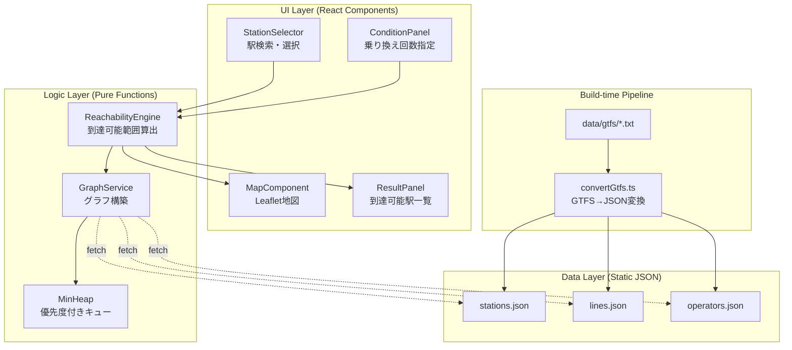
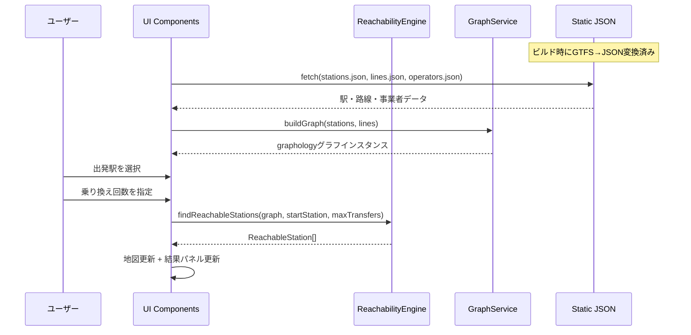
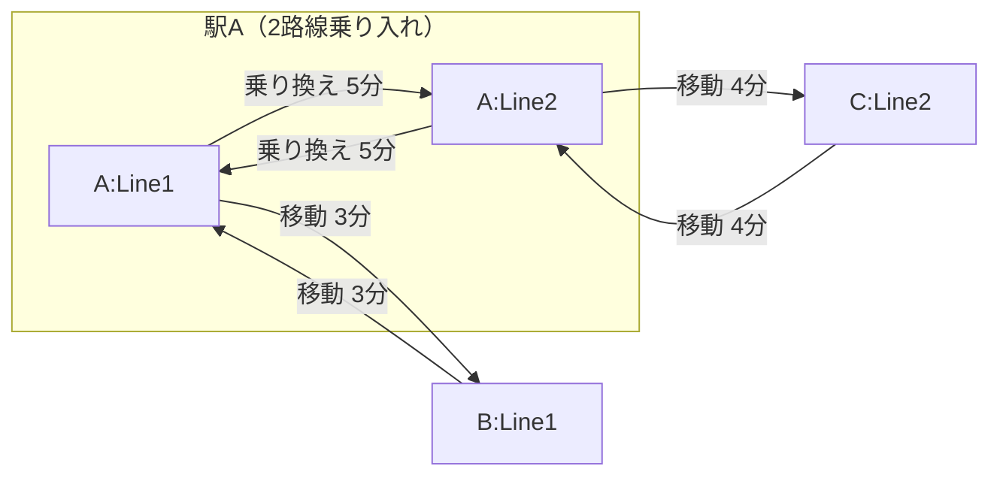

# 設計書: 駅到達可能範囲マップ

## 概要

本アプリケーションは、首都圏の鉄道網において、選択した出発駅から指定した乗り換え回数以内で到達可能な路線・駅を地図上に可視化するWebアプリケーションである。

### 設計方針

- **効率的なグラフ探索**: ヒープベースの優先度付きキューと `(stationId, lineId)` ペアによる訪問管理で、正確かつ高速な到達可能範囲算出を実現
- **明示的な乗り換えモデル**: 乗り換えをグラフのエッジとして明示的にモデル化し、探索ロジックの正確性と拡張性を確保
- **UIから独立したロジック層**: 到達可能範囲エンジン・グラフサービスを純粋関数として実装し、テスト容易性を確保
- **プロパティベーステスト**: fast-checkを活用し、正確性プロパティを網羅的に検証

### 技術スタック

| カテゴリ       | 技術                      |
| -------------- | ------------------------- |
| フロントエンド | TypeScript + React + Vite |
| 地図描画       | Leaflet + react-leaflet   |
| グラフ探索     | graphology                |
| スタイリング   | Tailwind CSS              |
| テスト         | Vitest + fast-check       |
| GTFS変換       | tsx                       |

## アーキテクチャ

### レイヤー構成



### データフロー



## コンポーネントとインターフェース

### ディレクトリ構成

```
src/
├── components/
│   ├── StationSelector.tsx      # 駅検索・選択
│   ├── ConditionPanel.tsx       # 乗り換え回数指定
│   ├── MapComponent.tsx         # Leaflet地図
│   └── ResultPanel.tsx          # 到達可能駅一覧
├── services/
│   ├── dataLoader.ts            # JSON読み込み
│   ├── graphService.ts          # グラフ構築
│   └── reachabilityEngine.ts    # 到達可能範囲算出
├── types/
│   └── index.ts                 # 全型定義
├── utils/
│   ├── minHeap.ts               # ヒープベース優先度付きキュー
│   ├── filterStations.ts        # 駅名フィルタリング
│   ├── colorScale.ts            # 移動時間→色変換
│   ├── sortResults.ts           # 結果ソート
│   └── validateCondition.ts     # 条件バリデーション
├── App.tsx
├── App.css
└── main.tsx
scripts/
└── convertGtfs.ts               # GTFS→JSON変換
public/data/
├── stations.json
├── lines.json
└── operators.json
```

### コンポーネント詳細

#### 1. StationSelector（駅セレクター）

駅名のテキスト入力と候補ドロップダウンを提供する。

```typescript
interface StationSelectorProps {
  stations: Station[];
  selectedStation: Station | null;
  onSelect: (station: Station) => void;
}
```

- 漢字・ひらがな・カタカナの部分一致検索
- `filterStations` ユーティリティを使用
- 候補には駅名と所属路線名を表示
- 入力が空の場合はドロップダウン非表示
- 0件の場合は「該当する駅が見つかりません」を表示

#### 2. ConditionPanel（条件パネル）

乗り換え回数の指定UIを提供する。

```typescript
interface ConditionPanelProps {
  condition: SearchCondition;
  onChange: (condition: SearchCondition) => void;
}
```

- 乗り換え回数: 0〜5回のスライダー（デフォルト: 1回）
- 範囲外の値は最も近い有効値に補正
- 変更時に即座に再計算をトリガー

#### 3. MapComponent（地図コンポーネント）

Leafletベースの地図表示。到達可能路線・駅を可視化する。

```typescript
interface MapComponentProps {
  stations: Station[];
  lines: Line[];
  reachableStations: ReachableStation[];
  reachableLineIds: Set<string>;
  startStation: Station | null;
  onStationClick: (station: ReachableStation) => void;
}
```

- 背景: 国土地理院タイル
- 初期中心: 東京駅付近（35.681, 139.767）
- 到達可能路線: shapes.txtの路線形状で描画、路線カラーで色付け
- 到達不可能路線: 低不透明度で表示
- 出発駅: 特別マーカー（色・サイズで区別）
- 到達可能駅: 大きめの円マーカー + 駅名ラベル
- 到達可能範囲更新時にバウンディングボックス自動調整

#### 4. ResultPanel（結果パネル）

到達可能駅の一覧をサイドパネルに表示する。

```typescript
interface ResultPanelProps {
  reachableStations: ReachableStation[];
  lines: Line[];
  onStationClick: (station: ReachableStation) => void;
}
```

- 路線別にグループ化して表示
- 各駅: 駅名、所属路線名、乗り換え回数、移動時間（分）
- ソート: 乗り換え回数昇順 → 移動時間昇順
- 駅名クリックで地図パン + ポップアップ
- 到達可能駅・路線の総数を表示
- 未選択時: 「出発駅を選択してください」

### サービス詳細

#### 1. dataLoader（データローダー）

```typescript
async function loadStations(): Promise<Station[]>;
async function loadLines(): Promise<Line[]>;
async function loadOperators(): Promise<Operator[]>;
```

- `public/data/` から fetch で JSON を読み込み
- 型安全なパース処理

#### 2. graphService（グラフサービス）

```typescript
function buildGraph(stations: Station[], lines: Line[]): Graph;
```

- graphology の directed + multi グラフを構築
- 各駅をノードとして追加
- 各路線の隣接駅間を双方向エッジで接続（路線ID、所要時間を属性に設定）
- 同一駅に複数路線が乗り入れる場合、路線間の乗り換えエッジ（所要時間5分、`isTransfer: true`）を追加

**乗り換えエッジの設計:**

- 同一駅に乗り入れる路線の全ペアについて、乗り換えエッジを追加
- 乗り換えエッジのノード表現: 各路線の駅を `stationId:lineId` の複合キーでノード化
- これにより、探索時の訪問管理が `(stationId, lineId)` ペアで自然に行える



#### 3. reachabilityEngine（到達可能範囲エンジン）

```typescript
function findReachableStations(
  graph: Graph,
  startStationId: string,
  condition: SearchCondition,
  stations: Map<string, Station>,
  lines: Map<string, Line>,
): ReachableStation[];
```

**探索アルゴリズム: 修正Dijkstra法**

1. 出発駅の全所属路線について、初期エントリ `(stationId:lineId, travelTime=0, transfers=0)` をヒープに追加
2. ヒープから最小コストのエントリを取り出す
3. 訪問済み `(stationId, lineId)` ペアならスキップ
4. 隣接エッジを走査:
   - 通常エッジ: 移動時間を加算
   - 乗り換えエッジ: 乗り換え時間5分を加算、乗り換え回数+1
   - `maxTransfers` を超える場合はスキップ
5. ヒープが空になるまで繰り返す
6. 各駅について最小移動時間の結果を返す

**設計上のポイント:**

- **優先度付きキュー**: ヒープベース実装により O(log n) の効率的な探索を実現
- **訪問管理**: `(stationId, lineId)` ペアで管理し、同一駅でも異なる路線経由の探索を正しく処理
- **乗り換えエッジ**: グラフに明示的に追加することで、乗り換え回数の正確なカウントを保証
- **路線形状**: shapes.txt から取得した座標で、地図上に実際の路線形状を描画

### ユーティリティ詳細

#### minHeap（最小ヒープ）

```typescript
class MinHeap<T> {
  constructor(comparator: (a: T, b: T) => number);
  push(item: T): void;
  pop(): T | undefined;
  peek(): T | undefined;
  get size(): number;
  get isEmpty(): boolean;
}
```

- 配列ベースのバイナリヒープ実装
- 汎用的なコンパレータを受け取る
- 到達可能範囲エンジンで使用

#### filterStations（駅名フィルタリング）

```typescript
function filterStations(stations: Station[], query: string): Station[];
```

- 漢字・ひらがな・カタカナの部分一致
- カタカナ→ひらがな変換で統一的にマッチング

#### validateCondition（条件バリデーション）

```typescript
function validateCondition(condition: SearchCondition): SearchCondition;
```

- `maxTransfers` を 0〜5 の範囲にクランプ
- 不正な値を最も近い有効値に補正

#### sortResults（結果ソート）

```typescript
function sortResults(results: ReachableStation[]): ReachableStation[];
```

- 乗り換え回数昇順 → 移動時間昇順

#### colorScale（色スケール）

```typescript
function getColorByTravelTime(travelTime: number, maxTime: number): string;
```

- 移動時間に応じた緑→黄→赤のグラデーション

### GTFS変換スクリプト（scripts/convertGtfs.ts）

```typescript
// 主要関数
async function main(): Promise<void>;
function parseCSVStream(
  filePath: string,
): AsyncIterable<Record<string, string>>;
function parseCSVLine(line: string, headers: string[]): Record<string, string>;
function convertStops(gtfsDir: string): Promise<Station[]>;
function convertRoutes(
  gtfsDir: string,
): Promise<{ lines: Line[]; operators: Operator[] }>;
function calculateTravelTimes(gtfsDir: string): Promise<Map<string, number>>;
function extractShapes(
  gtfsDir: string,
): Promise<Map<string, [number, number][]>>;
```

- RFC 4180 準拠のCSVパーサー（クォートされたフィールド対応）
- stop_times.txt は readline によるストリーミング処理
- parent_station による駅の正規化
- translations.txt から日本語駅名・かな駅名を取得
- 隣接駅間所要時間は同一区間の複数tripから中央値を採用
- shapes.txt から路線形状座標を抽出し、lines.json の各区間に含める

### 二週目: 所要時間取得（拡張機能）

```typescript
// 所要時間取得サービス
async function fetchTravelTime(
  fromStationId: string,
  toStationId: string,
): Promise<number>;

// キャッシュサービス
function getCachedTravelTime(fromId: string, toId: string): number | null;
function setCachedTravelTime(fromId: string, toId: string, time: number): void;
function cleanExpiredCache(): void;
```

- 外部API（二週目で選定）を使用して電車での所要時間を取得
- キャッシュキー: `${fromStationId}-${toStationId}`
- キャッシュ有効期限: 24時間
- レートリミット制御

## データモデル

### 型定義（src/types/index.ts）

```typescript
/** 駅 */
export interface Station {
  id: string; // 一意の駅ID（parent_station または stop_id）
  name: string; // 駅名（日本語）
  nameKana: string; // 駅名かな
  lat: number; // 緯度
  lng: number; // 経度
  lineIds: string[]; // 所属路線IDリスト
  operatorId: string; // 事業者ID
}

/** 路線 */
export interface Line {
  id: string; // 路線ID
  name: string; // 路線名（日本語）
  operatorId: string; // 事業者ID
  color: string; // 路線カラー（#RRGGBB）
  stationIds: string[]; // 駅IDリスト（順序付き）
  segments: LineSegment[];
}

/** 路線区間 */
export interface LineSegment {
  fromStationId: string;
  toStationId: string;
  travelTime: number; // 所要時間（分）
  coordinates: [number, number][]; // 経路座標（shapes.txtから取得）
}

/** 事業者 */
export interface Operator {
  id: string; // 事業者ID
  name: string; // 事業者名（日本語）
  lineIds: string[]; // 運営路線IDリスト
}

/** 検索条件 */
export interface SearchCondition {
  maxTransfers: number; // 乗り換え回数上限（0〜5）
}

/** 到達可能駅 */
export interface ReachableStation {
  station: Station;
  travelTime: number; // 出発駅からの移動時間（分）
  transfers: number; // 乗り換え回数
  route: RouteStep[]; // 経路詳細
}

/** 経路ステップ */
export interface RouteStep {
  lineId: string;
  fromStationId: string;
  toStationId: string;
  travelTime: number;
}

/** グラフノード属性 */
export interface NodeAttributes {
  stationId: string;
  lineId: string;
}

/** グラフエッジ属性 */
export interface EdgeAttributes {
  travelTime: number;
  isTransfer: boolean;
  lineId: string;
}

/** 探索キューエントリ */
export interface SearchEntry {
  nodeId: string; // "stationId:lineId"
  travelTime: number;
  transfers: number;
  route: RouteStep[];
}

/** 所要時間キャッシュエントリ（二週目） */
export interface TravelTimeCache {
  time: number;
  cachedAt: number; // Unix timestamp
}
```

### 静的JSONスキーマ

#### stations.json

```json
[
  {
    "id": "parent_station_id",
    "name": "東京",
    "nameKana": "とうきょう",
    "lat": 35.6812,
    "lng": 139.7671,
    "lineIds": ["JR-East.ChuoRapid", "JR-East.KeihinTohoku", ...],
    "operatorId": "JR-East"
  }
]
```

#### lines.json

```json
[
  {
    "id": "JR-East.ChuoRapid",
    "name": "中央線快速",
    "operatorId": "JR-East",
    "color": "#F15A22",
    "stationIds": ["tokyo", "kanda", "ochanomizu", ...],
    "segments": [
      {
        "fromStationId": "tokyo",
        "toStationId": "kanda",
        "travelTime": 2,
        "coordinates": [[35.6812, 139.7671], [35.6918, 139.7709], ...]
      }
    ]
  }
]
```

#### operators.json

```json
[
  {
    "id": "JR-East",
    "name": "JR東日本",
    "lineIds": ["JR-East.ChuoRapid", "JR-East.KeihinTohoku", ...]
  }
]
```

## 正確性プロパティ（Correctness Properties）

_プロパティとは、システムの全ての有効な実行において成り立つべき特性や振る舞いのことである。人間が読める仕様と機械的に検証可能な正確性保証の橋渡しとなる。_

### Property 1: 駅データのJSON変換ラウンドトリップ

_For any_ 有効な駅データ（Station）に対して、JSONにシリアライズし、再度パースした結果は元のデータと等価である。

**Validates: Requirements 1.8**

### Property 2: parent_station による駅の正規化

_For any_ stops データセットにおいて、同一の parent_station を持つ複数の stop は、変換後に同一の駅IDに正規化される。正規化後の駅数は、ユニークな parent_station の数（parent_station が空の stop は個別にカウント）と一致する。

**Validates: Requirements 1.2**

### Property 3: 翻訳データからの日本語駅名取得

_For any_ translations データセットにおいて、`table_name=stops, field_name=stop_name` のエントリから、`language=ja` で日本語名を、`language=ja-Hrkt` でかな名を正しく抽出する。抽出結果は元の翻訳データの該当エントリと一致する。

**Validates: Requirements 1.3**

### Property 4: 所要時間の中央値算出

_For any_ 正の整数の配列（同一区間の複数trip所要時間）に対して、算出された中央値は、配列をソートした場合の中央の値と一致する。

**Validates: Requirements 1.5**

### Property 5: RFC 4180 CSVパースのラウンドトリップ

_For any_ 有効なCSVフィールド値の配列に対して、RFC 4180形式でシリアライズし、再度パースした結果は元のフィールド値と等価である。特にカンマ、ダブルクォート、改行を含むフィールドが正しく処理される。

**Validates: Requirements 1.7**

### Property 6: 駅名フィルタリングの正確性

_For any_ 駅リストと検索クエリに対して、フィルタリング結果の全ての駅は、駅名（漢字）、かな名、またはカタカナ変換名のいずれかがクエリを部分文字列として含む。かつ、元のリストでこの条件を満たす駅は全て結果に含まれる。

**Validates: Requirements 2.1**

### Property 7: 検索条件バリデーション（クランプ）

_For any_ 整数値に対して、バリデーション後の乗り換え回数は 0 以上 5 以下の範囲内であり、元の値が範囲内であればそのまま、範囲外であれば最も近い境界値（0 または 5）となる。

**Validates: Requirements 3.4**

### Property 8: 到達可能範囲の正確性

_For any_ 有効なグラフ、出発駅、乗り換え回数上限に対して、到達可能範囲エンジンが返す全ての駅は以下を満たす:

- 乗り換え回数が指定上限以下である
- 移動時間が非負である
- 経路に含まれる乗り換え1回あたり固定5分が加算されている
- 経路の各ステップの所要時間の合計（乗り換え時間含む）が、報告された移動時間と一致する

**Validates: Requirements 4.1, 4.2, 4.3, 4.4**

### Property 9: 複数路線所属駅からの出発

_For any_ 複数路線に所属する出発駅に対して、到達可能範囲エンジンは全ての所属路線上の隣接駅を乗り換え0回で到達可能として返す。

**Validates: Requirements 4.7**

### Property 10: グラフの双方向性

_For any_ 構築されたグラフのエッジ（A→B、路線L、所要時間T）に対して、逆方向のエッジ（B→A、路線L、所要時間T）も存在する。

**Validates: Requirements 5.2, 5.5**

### Property 11: グラフの乗り換えエッジ

_For any_ N本の路線が乗り入れる駅に対して、グラフには N\*(N-1) 本の乗り換えエッジが存在し、各乗り換えエッジの所要時間は5分、isTransfer属性はtrueである。

**Validates: Requirements 5.3, 5.4**

### Property 12: バウンディングボックスの包含性

_For any_ 座標を持つ駅の集合に対して、算出されたバウンディングボックスは全ての駅の座標を包含する。

**Validates: Requirements 6.7**

### Property 13: 結果ソートの正確性

_For any_ 到達可能駅のリストに対して、ソート後のリストは乗り換え回数の昇順であり、同一乗り換え回数内では移動時間の昇順である。かつ、ソート前後で要素の集合は同一である。

**Validates: Requirements 7.3**

### Property 14: 結果の路線別グループ化と情報完全性

_For any_ 到達可能駅のリストに対して、路線別にグループ化した結果の各グループ内の全駅はその路線に所属し、各駅について駅名・所属路線名・乗り換え回数・移動時間が含まれる。到達可能駅の総数と到達可能路線の総数は実データと一致する。

**Validates: Requirements 7.1, 7.2, 7.5**

### Property 15: 所要時間キャッシュのラウンドトリップ（二週目）

_For any_ 出発駅IDと到着駅IDのペア、および正の所要時間に対して、キャッシュに保存し、同じキー（`${fromId}-${toId}`）で取得した結果は元の所要時間と一致する。

**Validates: Requirements 10.1, 10.2, 10.3**

### Property 16: キャッシュの有効期限（二週目）

_For any_ キャッシュエントリに対して、保存から24時間以上経過した場合、取得結果はnull（期限切れ）となる。24時間未満の場合は有効な値が返る。

**Validates: Requirements 10.4**

## エラーハンドリング

### データ読み込みエラー

| エラー状況                   | 対処                            | ユーザーへの表示                                                           |
| ---------------------------- | ------------------------------- | -------------------------------------------------------------------------- |
| stations.json の fetch 失敗  | リトライ1回後、エラー状態に遷移 | 「駅データの読み込みに失敗しました。ページを再読み込みしてください。」     |
| lines.json の fetch 失敗     | 同上                            | 「路線データの読み込みに失敗しました。ページを再読み込みしてください。」   |
| operators.json の fetch 失敗 | 同上                            | 「事業者データの読み込みに失敗しました。ページを再読み込みしてください。」 |
| JSON パースエラー            | エラー状態に遷移                | 「データの形式が不正です。データファイルを再生成してください。」           |

### GTFS変換スクリプトエラー

| エラー状況                        | 対処                                                      |
| --------------------------------- | --------------------------------------------------------- |
| GTFSファイルが存在しない          | エラーメッセージを表示し、`data/gtfs/` への配置手順を案内 |
| CSVパースエラー（不正な行）       | 警告をログ出力し、該当行をスキップして処理を継続          |
| 所要時間データが0件の区間         | 警告をログ出力し、デフォルト値（3分）を使用               |
| shapes.txt に該当路線の形状がない | 警告をログ出力し、直線で駅間を接続                        |

### 探索エラー

| エラー状況                 | 対処                                                           |
| -------------------------- | -------------------------------------------------------------- |
| 出発駅がグラフに存在しない | 空の結果を返し、UIで「この駅からの探索結果はありません」と表示 |
| グラフが未構築             | 探索を実行せず、データ読み込み完了を待つ                       |

### 二週目: API呼び出しエラー

| エラー状況                     | 対処                     | ユーザーへの表示                  |
| ------------------------------ | ------------------------ | --------------------------------- |
| API呼び出しタイムアウト        | 10秒でタイムアウト       | 「所要時間の取得に失敗しました」  |
| APIレスポンスエラー（4xx/5xx） | エラーをキャッチ         | 「所要時間の取得に失敗しました」  |
| レートリミット超過             | 一定時間待機後にリトライ | 「所要時間を取得中...」を継続表示 |

## テスト戦略

### テストフレームワーク

- **Vitest**: ユニットテスト・プロパティテストの実行環境
- **fast-check**: プロパティベーステストライブラリ
- **@fast-check/vitest**: Vitest との統合
- **@testing-library/react**: コンポーネントテスト
- テスト実行コマンド: `npx vitest --run`

### デュアルテストアプローチ

本プロジェクトでは、ユニットテストとプロパティベーステストの両方を使用する。

- **ユニットテスト**: 具体的な入出力例、エッジケース、エラー条件の検証
- **プロパティベーステスト**: 全入力に対して成り立つべき普遍的な性質の検証
- 両者は補完的であり、ユニットテストは具体的なバグを、プロパティテストは一般的な正確性を検証する

### プロパティベーステスト設定

- 各プロパティテストは最低100イテレーション実行する
- 各テストにはコメントで設計書のプロパティを参照する
- タグ形式: `Feature: station-reachability-map, Property {番号}: {プロパティ名}`
- 各正確性プロパティは1つのプロパティベーステストで実装する

### テストファイル配置

プロジェクトルールに従い、テストファイルは対象ファイルと同じディレクトリに配置する:

```
src/
├── utils/
│   ├── minHeap.ts
│   ├── minHeap.test.ts
│   ├── filterStations.ts
│   ├── filterStations.test.ts
│   ├── sortResults.ts
│   ├── sortResults.test.ts
│   ├── validateCondition.ts
│   ├── validateCondition.test.ts
│   └── colorScale.test.ts
├── services/
│   ├── graphService.ts
│   ├── graphService.test.ts
│   ├── reachabilityEngine.ts
│   └── reachabilityEngine.test.ts
├── components/
│   ├── StationSelector.test.tsx
│   ├── ConditionPanel.test.tsx
│   ├── MapComponent.test.tsx
│   └── ResultPanel.test.tsx
scripts/
├── convertGtfs.ts
└── convertGtfs.test.ts
```

### テスト対象とプロパティの対応

| テストファイル               | プロパティ                           | テスト種別 |
| ---------------------------- | ------------------------------------ | ---------- |
| `convertGtfs.test.ts`        | Property 1 (JSON ラウンドトリップ)   | プロパティ |
| `convertGtfs.test.ts`        | Property 2 (parent_station 正規化)   | プロパティ |
| `convertGtfs.test.ts`        | Property 3 (翻訳データ抽出)          | プロパティ |
| `convertGtfs.test.ts`        | Property 4 (中央値算出)              | プロパティ |
| `convertGtfs.test.ts`        | Property 5 (CSV ラウンドトリップ)    | プロパティ |
| `filterStations.test.ts`     | Property 6 (駅名フィルタリング)      | プロパティ |
| `validateCondition.test.ts`  | Property 7 (条件クランプ)            | プロパティ |
| `reachabilityEngine.test.ts` | Property 8 (到達可能範囲)            | プロパティ |
| `reachabilityEngine.test.ts` | Property 9 (複数路線出発)            | プロパティ |
| `graphService.test.ts`       | Property 10 (双方向性)               | プロパティ |
| `graphService.test.ts`       | Property 11 (乗り換えエッジ)         | プロパティ |
| `MapComponent.test.tsx`      | Property 12 (バウンディングボックス) | プロパティ |
| `sortResults.test.ts`        | Property 13 (ソート正確性)           | プロパティ |
| `ResultPanel.test.tsx`       | Property 14 (グループ化・情報完全性) | プロパティ |

### ユニットテスト（具体例・エッジケース）

| テストファイル              | テスト内容                        | 対応要件 |
| --------------------------- | --------------------------------- | -------- |
| `convertGtfs.test.ts`       | shapes.txt からの座標抽出         | 1.6      |
| `filterStations.test.ts`    | 空文字入力で空配列を返す          | 2.4      |
| `filterStations.test.ts`    | 0件時のメッセージ確認             | 2.5      |
| `validateCondition.test.ts` | デフォルト値が1であること         | 3.3      |
| `graphService.test.ts`      | directed + multi グラフの構築確認 | 5.1      |
| `MapComponent.test.tsx`     | 初期中心座標の確認                | 6.2      |
| `ResultPanel.test.tsx`      | 未選択時のメッセージ表示          | 7.6      |
