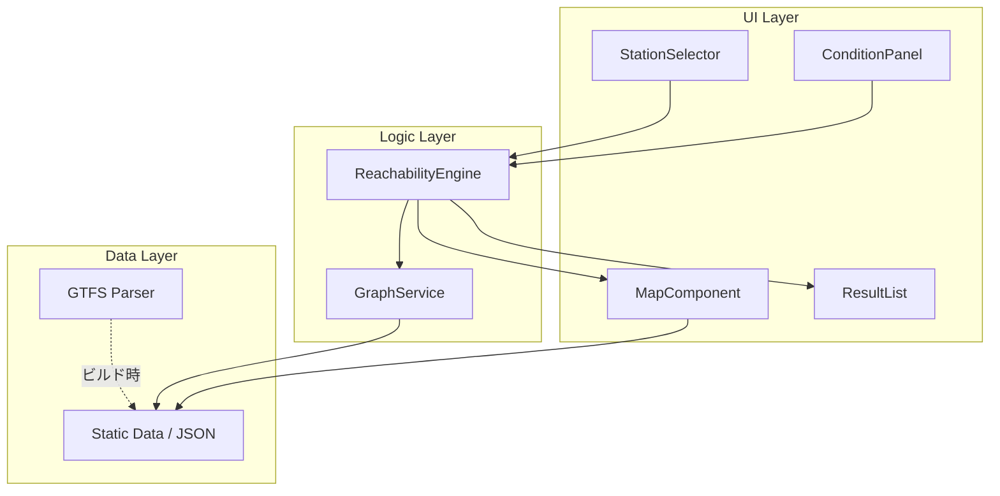
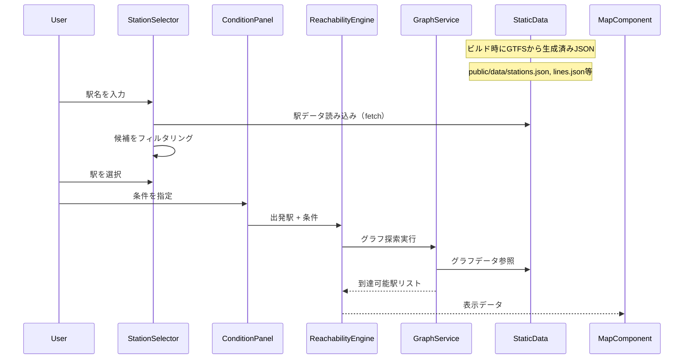

# 設計書: 駅到達可能範囲マップ

## 概要

本アプリケーションは、ユーザーが出発駅を選択し、移動時間・乗り換え回数などの条件を指定することで、到達可能な駅・エリアを地図上に視覚的に表示するWebアプリケーションである。

### 設計方針

- **段階的開発**: 最小限の機能から段階的に構築する（Phase 1〜4）
- **モジュラー設計**: 各コンポーネントを独立して開発・テスト可能にする
- **ローカル実行**: localhost上で動作するPC向けWebアプリケーション

### 開発フェーズ

| フェーズ | 機能                            | 対応要件             |
| -------- | ------------------------------- | -------------------- |
| Phase 1  | 駅選択 + 基本地図表示           | 要件1, 要件2         |
| Phase 2  | 到達可能範囲算出 + マーカー表示 | 要件3, 要件4（一部） |
| Phase 3  | 路線オーバーレイ                | 要件4（残り）, 要件5 |
| Phase 4  | 一覧表示 + 路線フィルタリング   | 要件6, 要件7         |
| 将来     | 駅別乗り換え時間の精緻化        | 要件3の精度向上      |

### 技術スタック

| カテゴリ       | 技術                                  | 理由                                                  |
| -------------- | ------------------------------------- | ----------------------------------------------------- |
| フロントエンド | TypeScript + React                    | 型安全性とコンポーネント指向開発                      |
| 地図描画       | Leaflet + react-leaflet               | 軽量・OSS・日本語タイル対応                           |
| 地図タイル     | OpenStreetMap (国土地理院タイル)      | 無料・日本語対応・localhost利用可                     |
| ビルドツール   | Vite                                  | 高速な開発サーバー                                    |
| 鉄道データ     | TokyoGTFS（mini-tokyo-3dベース）      | 首都圏全都市鉄道のGTFS・MITライセンス・オフライン完結 |
| GTFSパーサー   | gtfs-utils または自作パーサー         | stop_times.txtから駅間所要時間を標準形式で算出        |
| グラフ探索     | graphology + graphology-shortest-path | 成熟したJSグラフライブラリ・Dijkstra組み込み          |
| テスト         | Vitest + fast-check                   | PBTライブラリとしてfast-checkを使用                   |

**鉄道データについて**: TokyoGTFS（https://github.com/MKuranowski/TokyoGTFS）を使用して首都圏の都市鉄道GTFSデータを生成する。TokyoGTFSはmini-tokyo-3dプロジェクトのデータをベースに、首都圏全都市鉄道の時刻表・直通運転情報を含むGTFSファイルを生成するPythonツールである。生成されたGTFSデータはMITライセンス（Copyright (c) 2019-2025 Akihiko Kusanagi）で利用可能。鉄道データの生成にAPIキーは不要（バスデータのみODPT APIキーが必要だが、本アプリでは鉄道のみ使用）。GTFSファイルをビルド時にパースし、アプリケーション用の静的JSONファイルに変換して`public/data/`に配置する。初期開発（Phase 1〜2）ではJR山手線・中央線など1〜2路線に限定してデバッグしやすくし、Phase 3以降で段階的に路線を追加、最終的に首都圏全路線に拡大する。

## アーキテクチャ

### 全体構成



### レイヤー構成

1. **UIレイヤー**: React コンポーネント群。ユーザー入力の受付と結果の表示を担当
2. **ロジックレイヤー**: 到達可能範囲の算出ロジック。UIから独立してテスト可能
3. **データレイヤー**: TokyoGTFSから生成した静的JSONファイルの読み込み。ビルド時にGTFSをパースして変換済み

### データフロー



## コンポーネントとインターフェース

### UIコンポーネント

#### StationSelector（駅セレクター）

出発駅の検索・選択を担当するコンポーネント。Phase 1で実装。

```typescript
interface StationSelectorProps {
  stations: Station[];
  onStationSelect: (station: Station) => void;
  selectedStation: Station | null;
}

// 駅名の部分一致フィルタリング
function filterStations(stations: Station[], query: string): Station[];
```

- テキスト入力による部分一致検索（ひらがな・カタカナ・漢字対応）
- 候補リストのドロップダウン表示
- 該当なし時のメッセージ表示

#### ConditionPanel（条件パネル）

検索条件の入力を担当するコンポーネント。Phase 1で基本機能、Phase 4で路線フィルタを追加。

```typescript
interface SearchCondition {
  maxTravelTime: number; // 5〜120分
  maxTransfers: number; // 0〜5回
  excludedLines: string[]; // 除外路線ID（Phase 4）
}

interface ConditionPanelProps {
  condition: SearchCondition;
  onConditionChange: (condition: SearchCondition) => void;
  availableLines: Line[]; // Phase 4
}

// バリデーション
function validateCondition(condition: SearchCondition): ValidationResult;
```

#### MapComponent（地図コンポーネント）

Leafletベースの地図表示を担当。Phase 1で基本地図、Phase 2〜3で段階的に機能追加。

```typescript
interface MapComponentProps {
  center: [number, number]; // 地図中心座標
  departureStation: Station | null;
  reachableStations: ReachableStation[]; // Phase 2
  routeOverlays: RouteOverlay[]; // Phase 3
  isochrones: Isochrone[]; // Phase 3
  onStationClick: (station: ReachableStation) => void;
}
```

#### ResultList（検索結果一覧）

到達可能駅の一覧表示を担当。Phase 4で実装。

```typescript
type SortKey = "travelTime" | "transfers" | "stationName" | "lineName";
type SortOrder = "asc" | "desc";

interface ResultListProps {
  results: ReachableStation[];
  sortKey: SortKey;
  sortOrder: SortOrder;
  onSortChange: (key: SortKey, order: SortOrder) => void;
  onStationClick: (station: ReachableStation) => void;
}

// ソート関数
function sortResults(
  results: ReachableStation[],
  key: SortKey,
  order: SortOrder,
): ReachableStation[];
```

### ロジックコンポーネント

#### ReachabilityEngine（到達可能範囲エンジン）

グラフ探索による到達可能駅の算出を担当。Phase 2で実装。

```typescript
import Graph from "graphology";

interface ReachabilityEngine {
  calculate(
    departureStationId: string,
    condition: SearchCondition,
    graph: Graph,
  ): ReachabilityResult;
}

interface ReachabilityResult {
  reachableStations: ReachableStation[];
  routes: RouteSegment[];
}

interface ReachableStation {
  station: Station;
  travelTime: number; // 分
  transfers: number;
  route: string[]; // 経由路線ID
}
```

#### GraphService（グラフサービス）

鉄道ネットワークのグラフ構造を構築・管理する。Phase 2で実装。graphologyライブラリを使用。

```typescript
import Graph from "graphology";
import { dijkstra } from "graphology-shortest-path";

// graphologyのグラフインスタンスを構築
// ノード: 駅ID、エッジ: 駅間の接続（移動時間を重みとして持つ）
function buildGraph(stations: Station[], lines: Line[]): Graph;

// graphologyのDijkstra実装を利用した到達可能駅探索
// maxTime/maxTransfers/excludedLinesの制約を適用
function findReachableStations(
  graph: Graph,
  startId: string,
  maxTime: number,
  maxTransfers: number,
  excludedLines: string[],
): ReachableStation[];
```

graphologyのグラフ構造:

- ノード属性: `{ station: Station }`
- エッジ属性: `{ lineId: string, travelTime: number, requiresTransfer: boolean }`

## データモデル

### 駅データ（Station）

```typescript
interface Station {
  id: string; // 一意の駅ID（例: "tokyo_JR_001"）
  name: string; // 駅名（例: "東京"）
  nameKana: string; // 駅名かな（例: "とうきょう"）
  lat: number; // 緯度
  lng: number; // 経度
  lineIds: string[]; // 所属路線IDリスト
  operatorId: string; // 事業者ID
}
```

### 路線データ（Line）

```typescript
interface Line {
  id: string; // 一意の路線ID（例: "JR_yamanote"）
  name: string; // 路線名（例: "山手線"）
  operatorId: string; // 事業者ID
  color: string; // 路線カラー（例: "#80C241"）
  stationIds: string[]; // 駅IDリスト（順序付き）
  segments: LineSegment[];
}

interface LineSegment {
  fromStationId: string;
  toStationId: string;
  travelTime: number; // 所要時間（分）- 時刻表データから算出
  coordinates: [number, number][]; // 経路座標（ポリライン描画用）
}
```

### 事業者データ（Operator）

```typescript
interface Operator {
  id: string; // 事業者ID（例: "JR_East"）
  name: string; // 事業者名（例: "JR東日本"）
  lineIds: string[]; // 運営路線IDリスト
}
```

### 到達可能駅データ（ReachableStation）

```typescript
interface ReachableStation {
  station: Station;
  travelTime: number; // 出発駅からの移動時間（分）
  transfers: number; // 乗り換え回数
  route: RouteStep[]; // 経路詳細
}

interface RouteStep {
  lineId: string;
  fromStationId: string;
  toStationId: string;
  travelTime: number;
}
```

### 表示用データ

```typescript
// 路線オーバーレイ
interface RouteOverlay {
  lineId: string;
  lineName: string;
  color: string;
  coordinates: [number, number][];
  isReachable: boolean; // 到達可能範囲内かどうか
}

// 等時線（アイソクロン）
interface Isochrone {
  timeMinutes: number; // 移動時間（分）
  polygon: [number, number][]; // 境界ポリゴン座標
  color: string;
}

// バリデーション結果
interface ValidationResult {
  isValid: boolean;
  errors: { field: string; message: string }[];
}
```

### データ取得とパイプライン

TokyoGTFSで生成したGTFSファイルをビルド時にパースし、アプリケーション用の静的JSONファイルに変換する。ランタイムではAPIコールは発生せず、`public/data/`配下のJSONファイルをfetchで読み込む。

#### GTFSファイル構造（入力）

TokyoGTFSが生成する主要なGTFSファイル:

- `stops.txt`: 駅データ（stop_id, stop_name, stop_lat, stop_lon, parent_station）
- `routes.txt`: 路線データ（route_id, route_short_name, route_long_name, route_color, agency_id）
- `trips.txt`: 運行データ（trip_id, route_id, service_id, block_id）
- `stop_times.txt`: 時刻表データ（trip_id, arrival_time, departure_time, stop_id, stop_sequence）
- `agency.txt`: 事業者データ（agency_id, agency_name）
- `calendar.txt` / `calendar_dates.txt`: 運行日データ

#### ビルド時変換スクリプト

```typescript
// scripts/convertGtfs.ts - ビルド時に実行するNode.jsスクリプト
// GTFSファイルを読み込み、アプリケーション用JSONに変換する

// 入力: data/gtfs/ ディレクトリ内のGTFSファイル群
// 出力: public/data/ ディレクトリ内のJSONファイル群

interface GtfsConvertConfig {
  gtfsDir: string; // GTFSファイルのディレクトリ
  outputDir: string; // 出力先ディレクトリ
  targetRoutes?: string[]; // 対象路線ID（Phase 1〜2では限定）
}

// stops.txt → stations.json
function convertStops(gtfsDir: string): Station[];

// routes.txt + agency.txt → lines.json + operators.json
function convertRoutes(gtfsDir: string): {
  lines: Line[];
  operators: Operator[];
};

// stop_times.txt + trips.txt → 駅間所要時間を算出してlines.jsonのsegmentsに反映
function calculateTravelTimes(gtfsDir: string): Map<string, number>;
```

#### 駅の正規化（parent_station）

GTFSでは同一駅でも路線ごとに異なるstop_idが割り当てられる場合がある。`stops.txt`の`parent_station`フィールドを使って同一駅を束ねる。`parent_station`が設定されている場合はそれを駅IDとして使用し、設定されていない場合は`stop_id`をそのまま使用する。

#### 駅間所要時間の算出方法

GTFSの`stop_times.txt`には各列車の各駅での発着時刻が標準形式（HH:MM:SS）で記録されている。隣接駅間の所要時間は以下の手順で算出する:

1. 平日日中の各停列車のtrip_idを`trips.txt`と`calendar.txt`から特定する
2. 各tripの`stop_times.txt`から、隣接駅間の`departure_time`（前駅）と`arrival_time`（次駅）の差分を計算する
3. 同一区間の複数tripから中央値を採用する

これはODPT APIの独自JSON形式をパースするより遥かにシンプルで、GTFSの標準仕様に準拠しているため信頼性が高い。

#### 出力JSONファイル

```typescript
// public/data/stations.json - 駅データ
// public/data/lines.json - 路線データ（segments含む）
// public/data/operators.json - 事業者データ

// データローダー（ランタイム）
interface DataLoader {
  loadStations(): Promise<Station[]>;
  loadLines(): Promise<Line[]>;
  loadOperators(): Promise<Operator[]>;
}

// fetchベースの実装
async function loadStations(): Promise<Station[]> {
  const response = await fetch("/data/stations.json");
  return response.json();
}
```

#### ODPT APIとの比較・採用理由

| 観点           | ODPT API                           | TokyoGTFS                            |
| -------------- | ---------------------------------- | ------------------------------------ |
| データ形式     | 独自JSON（事業者ごとに癖あり）     | GTFS標準形式（全事業者統一）         |
| 駅間所要時間   | TrainTimetableから自前算出（複雑） | stop_times.txtの差分計算（シンプル） |
| APIキー        | 必須（開発者登録）                 | 鉄道データは不要                     |
| ランタイム依存 | あり（API呼び出し＋キャッシュ）    | なし（静的JSON）                     |
| データ鮮度     | リアルタイム取得可能               | GTFSファイル再生成で更新             |
| カバレッジ     | 事業者ごとに公開範囲が異なる       | 首都圏全都市鉄道                     |
| ライセンス     | ODPT利用規約                       | MIT License                          |
| オフライン動作 | キャッシュ依存                     | 完全オフライン                       |

TokyoGTFSを採用する主な理由: データ形式の標準化、駅間所要時間算出のシンプルさ、APIキー不要、完全オフライン動作。データ鮮度はリアルタイム性が不要な本アプリでは問題にならない。

### 設計判断の根拠

1. **TokyoGTFS（GTFSデータ）の採用**: TokyoGTFS（https://github.com/MKuranowski/TokyoGTFS）はmini-tokyo-3dプロジェクトのデータをベースに、首都圏全都市鉄道のGTFSファイルを生成するPythonツール。生成されたGTFSデータはMITライセンスで利用可能。ODPT APIと比較して、(1) データ形式がGTFS標準で統一されており事業者ごとの癖がない、(2) stop_times.txtから駅間所要時間を標準的な方法で算出できる、(3) APIキー不要で鉄道データを取得できる、(4) 静的ファイルとして完全オフラインで動作する、という利点がある。GTFSファイルをビルド時にパースしてアプリ用JSONに変換するため、ランタイムでのAPI呼び出しやキャッシュ管理が不要になる。

2. **graphologyの採用**: graphologyは成熟したJavaScriptグラフライブラリで、Dijkstra法が`graphology-shortest-path`パッケージに組み込まれている。TypeScript型定義も提供されており、自前実装の必要がない。鉄道ネットワーク規模（数千ノード）ではブラウザ上で十分高速に動作する。乗り換え回数の制約は探索時のフィルタ条件として実装する。

   **探索手法の選定根拠**: 「出発駅から全ての到達可能駅への最短時間」を求める問題は、単一始点最短経路問題そのもの。駅間の移動時間は路線によって異なる（重み付きグラフ）ため、BFSは不適切。A\*はゴールが1つの場合に有効だが、全到達可能駅を求める今回のケースではヒューリスティックの恩恵がない。Dijkstra法が最適解。

   **パフォーマンス見積もり**: 首都圏の鉄道駅は約2,000〜3,000駅、エッジ数は約10,000。Dijkstra法の計算量O((V+E) log V)で、この規模では数ミリ秒〜数十ミリ秒で完了する。ブラウザ上でも体感的に即座に結果が返るレベル。

3. **Leafletの採用**: Google Maps APIはAPIキーとコスト管理が必要。Leafletは完全無料のOSSで、OpenStreetMapタイルと組み合わせてlocalhost開発に最適。react-leafletでReactとの統合も容易。

4. **乗り換え時間のモデル化**: 同一駅での路線変更を「乗り換え」として扱い、グラフのエッジとして追加する。
   - **Phase 2（初期実装）**: 固定の乗り換え時間（デフォルト5分）を使用。全ての乗り換えに一律適用。
   - **将来スプリント**: 駅ごとの実際の乗り換え時間データを取得・反映する。大規模ターミナル駅（例: 新宿、東京、渋谷）では乗り換えに10分以上かかる場合もあるため、駅・路線の組み合わせごとに正確な乗り換え時間を設定する。データソースとしてはGTFSのtransfers.txt（将来TokyoGTFSが対応した場合）や、独自の乗り換え時間データベースを検討する。

## 正確性プロパティ

_プロパティとは、システムの全ての有効な実行において成立すべき特性や振る舞いのことである。プロパティは、人間が読める仕様と機械的に検証可能な正確性保証の橋渡しとなる。_

### Property 1: 駅名フィルタリングの正確性

*任意の*駅データセットと*任意の*検索文字列に対して、`filterStations`が返す全ての駅は、駅名（漢字・かな）に検索文字列を部分文字列として含む。また、返されない駅は検索文字列を含まない。

**Validates: Requirements 1.2**

### Property 2: 駅選択時の地図中心移動

*任意の*駅に対して、その駅を選択した場合、地図の中心座標はその駅の緯度・経度と一致する。

**Validates: Requirements 1.3, 1.4, 6.5**

### Property 3: 検索条件バリデーション

*任意の*数値に対して、`validateCondition`は以下を満たす: 最大移動時間が5〜120の範囲内かつ最大乗り換え回数が0〜5の範囲内の場合のみ`isValid: true`を返し、範囲外の場合は対応するエラーメッセージを含む`ValidationResult`を返す。

**Validates: Requirements 2.3, 2.4, 2.6**

### Property 4: 条件変更の即時反映

*任意の*有効な`SearchCondition`に対して、条件パネルで値を変更した場合、アプリケーションの検索パラメータ状態は変更後の値と一致する。

**Validates: Requirements 2.5, 7.4**

### Property 5: 到達可能駅算出の正確性

\_任意の\_graphologyグラフ、出発駅、および有効な`SearchCondition`に対して、`findReachableStations`が返す全ての`ReachableStation`は、`travelTime <= maxTravelTime`かつ`transfers <= maxTransfers`を満たす。また、これらの条件を満たす駅で結果に含まれないものは存在しない。

**Validates: Requirements 3.1, 3.2, 3.3**

### Property 6: グラフ構築とエッジ重みの正確性

*任意の*路線データと時刻表データに対して、`buildGraph`が生成するグラフの各エッジの`travelTime`は、時刻表から算出された駅間所要時間と一致する。また、同一駅で異なる路線間の乗り換えエッジは、乗り換え時間を`travelTime`として持つ。

**Validates: Requirements 3.4, 3.5**

### Property 7: 移動時間に応じた色分けの一貫性

*任意の*2つの移動時間`t1 < t2`に対して、色分け関数が返す色は、`t1`の方が`t2`より「近い」ことを示す色（例: 緑→黄→赤のグラデーション）である。同じ移動時間に対しては常に同じ色を返す。

**Validates: Requirements 4.2**

### Property 8: バウンディングボックスの包含性

*任意の*到達可能駅セットに対して、計算されるバウンディングボックスは全ての到達可能駅の座標を包含する。

**Validates: Requirements 4.6**

### Property 9: ポップアップ・リスト項目の情報完全性

_任意の_`ReachableStation`に対して、生成されるポップアップ内容およびリスト項目には、駅名・移動時間・乗り換え回数が全て含まれる。リスト項目にはさらに路線名が含まれる。

**Validates: Requirements 4.5, 6.2**

### Property 10: 到達可能/不可能路線の色分け

*任意の*路線と到達可能フラグに対して、`isReachable: true`の路線は通常の色で、`isReachable: false`の路線は薄い色（低い不透明度）で表示される。

**Validates: Requirements 5.4**

### Property 11: ソートの正確性

_任意の_`ReachableStation`リストと*任意の*ソートキー・ソート順に対して、`sortResults`が返すリストは指定されたキーで指定された順序にソートされている。デフォルトでは移動時間の昇順である。

**Validates: Requirements 6.3, 6.4**

### Property 12: デフォルト全路線選択

*任意の*路線データセットに対して、条件パネルの初期状態では全ての路線が選択状態である。

**Validates: Requirements 7.3**

### Property 13: 路線フィルタの探索反映

\_任意の\_graphologyグラフと*任意の*除外路線セットに対して、`findReachableStations`が返す到達可能駅の経路（`route`）には、除外された路線IDが含まれない。

**Validates: Requirements 7.5**

### Property 14: 事業者グループ化の正確性

*任意の*路線・事業者データに対して、グループ化関数が返す結果では、各グループ内の全路線が同一の`operatorId`を持ち、全ての路線がいずれかのグループに属する。

**Validates: Requirements 7.6**

### Property 15: 事業者一括選択・解除

*任意の*事業者に対して、一括選択操作後はその事業者の全路線が選択状態となり、一括解除操作後はその事業者の全路線が非選択状態となる。

**Validates: Requirements 7.7**

## エラーハンドリング

### エラー分類

| カテゴリ       | エラー内容                     | 対応                                                 |
| -------------- | ------------------------------ | ---------------------------------------------------- |
| データ取得     | 静的JSONファイルの読み込み失敗 | エラーメッセージ表示 + リロードボタン                |
| データ取得     | GTFSデータが未生成             | データ生成手順を示すメッセージ表示                   |
| バリデーション | 移動時間が範囲外（5〜120分）   | 入力欄にエラーメッセージ表示、検索実行を阻止         |
| バリデーション | 乗り換え回数が範囲外（0〜5回） | 入力欄にエラーメッセージ表示、検索実行を阻止         |
| バリデーション | 全路線が選択解除               | エラーメッセージ表示、検索実行を阻止                 |
| 検索           | 該当する駅が見つからない       | 「該当する駅が見つかりません」メッセージ表示         |
| 算出           | 到達可能駅が0件                | 「条件に合う駅が見つかりませんでした」メッセージ表示 |

### エラーハンドリング方針

- バリデーションエラーはリアルタイムで表示し、ユーザーが即座に修正できるようにする
- データ取得エラーはアプリケーション起動時に検出し、静的JSONファイルが存在しない場合はユーザーに通知する
- 算出エラーは結果表示エリアにメッセージを表示する
- 全てのエラーメッセージは日本語で表示する

## テスト戦略

### テストフレームワーク

- **ユニットテスト**: Vitest
- **プロパティベーステスト**: fast-check（Vitest上で実行）
- **コンポーネントテスト**: React Testing Library

### テストアプローチ

ユニットテストとプロパティベーステストの二本柱で網羅的にテストする。

#### ユニットテスト

具体的な例示・エッジケース・エラー条件の検証に使用する。

- 駅データの読み込み確認（要件1.1）
- 検索文字列に一致する駅がない場合のメッセージ表示（要件1.5）
- 条件パネルの入力欄の存在確認（要件2.1, 2.2）
- 路線データ取得失敗時のエラーメッセージ（要件3.6）— 静的JSONファイル読み込み失敗時
- 路線オーバーレイの生成確認（要件4.4, 5.1）
- 到達可能駅一覧の表示確認（要件6.1）
- 路線一覧・チェックボックスの表示確認（要件7.1, 7.2）
- 全路線解除時のエラーメッセージ（要件7.8）

#### プロパティベーステスト

全ての正確性プロパティ（Property 1〜15）をプロパティベーステストとして実装する。

**設定要件**:

- 各テストは最低100回のイテレーションで実行する
- 各テストにはコメントで対応するプロパティを参照する
- タグ形式: `Feature: station-reachability-map, Property {番号}: {プロパティ名}`

**テスト対象の優先順位**（フェーズに合わせて段階的に実装）:

| フェーズ | テスト対象プロパティ       |
| -------- | -------------------------- |
| Phase 1  | Property 1, 2, 3, 4, 12    |
| Phase 2  | Property 5, 6, 7, 8        |
| Phase 3  | Property 10                |
| Phase 4  | Property 9, 11, 13, 14, 15 |

**各プロパティテストの実装方針**:

- **Property 1** (駅名フィルタリング): ランダムな駅データと検索文字列を生成し、フィルタ結果の正確性を検証
- **Property 2** (地図中心移動): ランダムな座標を持つ駅を生成し、選択後の地図中心座標を検証
- **Property 3** (バリデーション): ランダムな数値を生成し、範囲内/外の判定を検証
- **Property 4** (条件変更反映): ランダムな条件値を生成し、状態更新を検証
- **Property 5** (到達可能駅算出): ランダムなグラフと条件を生成し、結果の正確性を検証。最重要テスト
- **Property 6** (グラフ構築): ランダムな路線データからグラフを構築し、エッジ重みの正確性を検証
- **Property 7** (色分け一貫性): ランダムな移動時間ペアを生成し、色の順序関係を検証
- **Property 8** (バウンディングボックス): ランダムな座標セットを生成し、包含性を検証
- **Property 9** (情報完全性): ランダムなReachableStationを生成し、表示内容の完全性を検証
- **Property 10** (路線色分け): ランダムな路線と到達可能フラグを生成し、色の正確性を検証
- **Property 11** (ソート): ランダムなリストとソートキーを生成し、ソート結果の正確性を検証
- **Property 12** (デフォルト選択): ランダムな路線セットを生成し、初期状態を検証
- **Property 13** (路線フィルタ): ランダムなグラフと除外路線を生成し、結果に除外路線が含まれないことを検証
- **Property 14** (グループ化): ランダムな路線・事業者データを生成し、グループ化の正確性を検証
- **Property 15** (一括選択): ランダムな事業者を生成し、一括操作後の状態を検証

### テスト実行

```bash
# ユニットテスト + プロパティベーステスト
npx vitest --run

# 特定のプロパティテストのみ実行
npx vitest --run --grep "Property"
```
